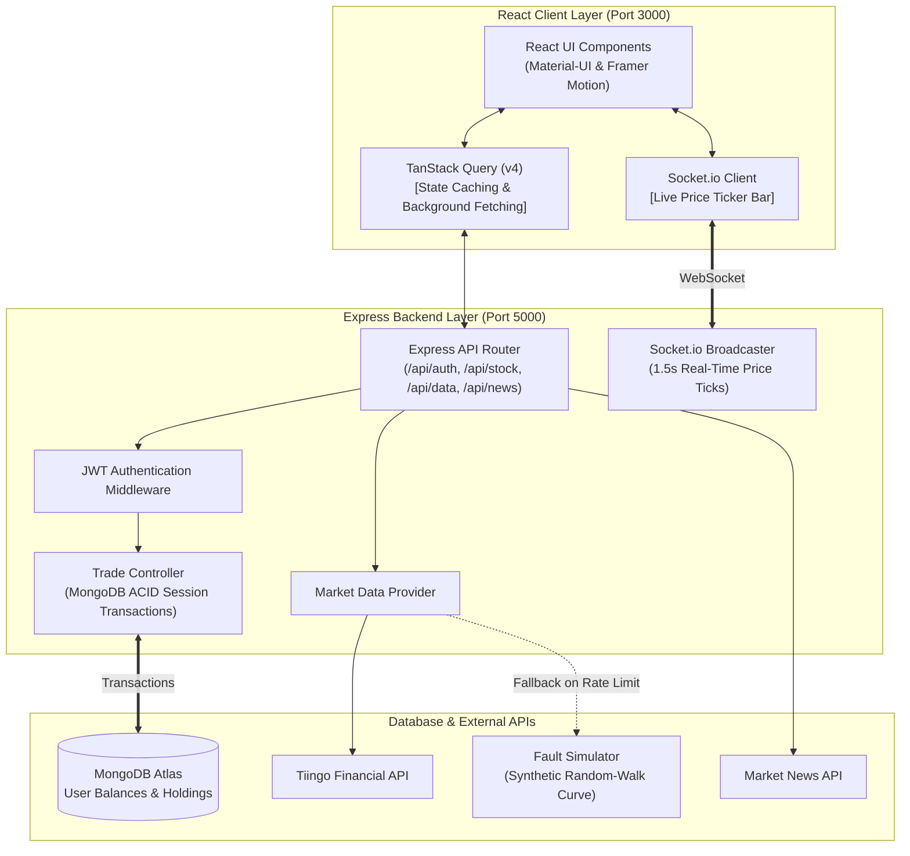
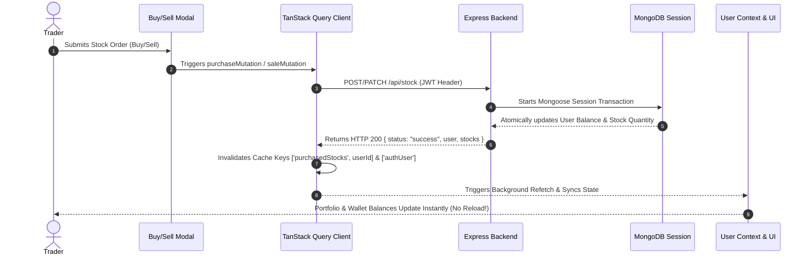

# 📈 Virtual Trading Playground

[](https://reactjs.org/)
[](https://tanstack.com/query/v4)
[](https://nodejs.org/)
[](https://www.mongodb.com/)
[](https://socket.io/)
[](LICENSE)

A high-performance, full-stack **Virtual Stock Trading & Portfolio Management Platform** built with **React, TanStack Query, Node.js, Express, MongoDB, and Socket.io**.

This platform allows users to simulate stock market trading with **$100,000 in virtual cash**, stream real-time price updates over WebSockets, analyze 2-year chart analytics, explore live market headlines, and execute ACID-compliant stock transactions in a risk-free environment.

---

## 🏗️ System Architecture



---

## ⚡ Data Flow & Mutation Invalidation Sequence



---

## ✨ Key Features

- **💼 $100,000 Virtual Portfolio**: Start with $100k virtual capital to buy and sell equities in a real-time simulated market.
- **⚡ Socket.io Real-Time Price Tickers**: Live color-flashing price ticker bar broadcasting price changes every 1.5 seconds.
- **🔄 TanStack Query Integration**:
  - Automatic client-side caching & background refetching for stock details, 2-year chart analytics, and user portfolios.
  - Zero full-page reloads—trade mutations automatically invalidate query caches for instant UI updates.
  - Infinite scroll news feed using `useInfiniteQuery`.
- **🛡️ ACID-Compliant Mongoose Transactions**: Buy/sell order controllers wrapped in Mongoose session transactions to guarantee database integrity.
- **🌐 Fault-Tolerant Market Data**: Integrates with the **Tiingo API** with automatic fallback to a synthetic random-walk stock price curve when API rate limits are hit.
- **🔒 JWT Authentication**: Secure session handling with JSON Web Tokens and instant demo login support.

---

## 🛠️ Tech Stack

| Domain | Technologies |
| :--- | :--- |
| **Frontend** | React 16.13.1, TanStack Query v4 (`@tanstack/react-query`), Material-UI, Framer Motion, Recharts |
| **Backend** | Node.js, Express.js, Socket.io, JWT (`jsonwebtoken`), Axios |
| **Database** | MongoDB Atlas, Mongoose (Transactions & Sessions) |
| **Data Sources** | Tiingo Financial API, Market News API, Socket.io Market Streamer |

---

## 📂 Folder Structure

```text
Virtual-Trading-Playground/
├── config/
│   └── .env                 # Backend environment variables
├── controllers/
│   ├── authController.js    # Register, login, JWT validation
│   ├── dataController.js    # Tiingo API integration & Fault Simulator fallback
│   ├── newsController.js    # Financial news feed handler
│   └── stockController.js   # Stock purchase/sale ACID transactions
├── models/
│   ├── Stock.js             # Stock holding schema
│   └── User.js              # User account & balance schema
├── services/
│   ├── marketDataProvider.js# Real-time stock price generator
│   └── socketService.js     # Socket.io live price broadcaster
├── routes/                  # Express REST API routes
├── frontend/
│   └── src/
│       ├── components/
│       │   ├── Authentication/# Login, Register & Demo access
│       │   ├── Dashboard/     # Chart, Balance & Holdings (Purchases & SaleModal)
│       │   ├── News/          # Market news with TanStack useInfiniteQuery
│       │   ├── Search/        # Stock search, 2-year chart, PurchaseModal
│       │   ├── Template/      # Navigation layout & Recharts LineChart
│       │   └── Ticker/        # Socket.io LiveTickerBar
│       ├── context/           # SocketContext & UserContext
│       └── index.js           # QueryClientProvider setup
├── index.js                 # Express server & Socket.io server entry point
└── README.md
```

---

## 🚀 Getting Started

### Prerequisites

- **Node.js**: v16+
- **MongoDB**: Local MongoDB instance or [MongoDB Atlas](https://www.mongodb.com/cloud/atlas) connection URI.

---

### 📦 Installation & Setup

1. **Clone the repository**:
   ```bash
   git clone https://github.com/saurabh1215/Virtual-Trading.git
   cd Virtual-Trading
   ```

2. **Backend Setup**:
   Install dependencies:
   ```bash
   npm install
   ```

   Configure environment variables in `config/.env`:
   ```env
   PORT=5000
   MONGO_URI=mongodb+srv://<username>:<password>@cluster0.ho17gck.mongodb.net/virtual-trading?retryWrites=true&w=majority
   JWT_SECRET=supersecretjwtkey12345
   NEWS_API_KEY=your_news_api_key
   TIINGO_API_KEY=your_tiingo_api_key
   ```

3. **Frontend Setup**:
   Install frontend dependencies:
   ```bash
   cd frontend
   npm install --legacy-peer-deps
   cd ..
   ```

---

## 🏃 Running the Application

### Option A: Run Backend & Frontend Concurrently
From the root directory:
```bash
npm run dev
```

### Option B: Run Services Separately
1. **Start Express & Socket.io Server (Port 5000)**:
   ```bash
   npm start
   ```
2. **Start React Client (Port 3000)**:
   ```bash
   cd frontend
   npm start
   ```

Open [http://localhost:3000](http://localhost:3000) in your browser.

---

## 📄 License

Distributed under the MIT License.